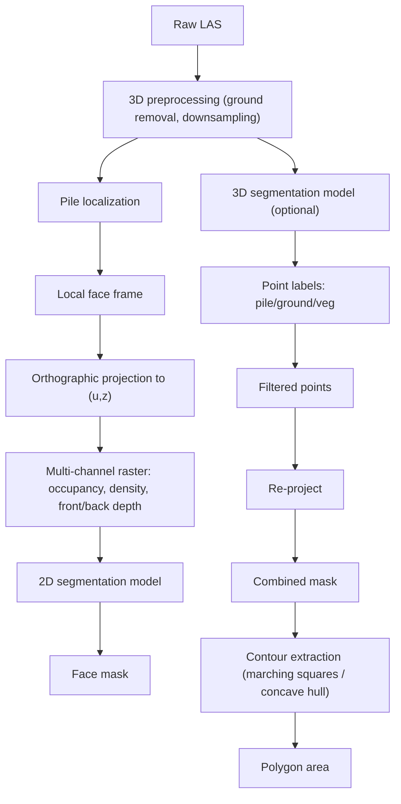

# Research note: hybrid geometry + ML face-measurement architecture (2026-08-26)

## Provenance and how to read this document

This document preserves the technical content of an external "deep research"
report obtained on 2026-08-26 (source file: `deep-research-report (2).md`,
commissioned to survey candidate methods for automating roadside timber-stack
face-area measurement).

It is a **literature and tooling survey produced by an external research
process**, not a Campo Digital experiment and not a result of this
repository's own code. Per
[`DOCUMENTATION_POLICY.md`](../DOCUMENTATION_POLICY.md), its claims are
preserved here as **HYPOTHESIS / external-claim**, not as FACT of this
project, with two exceptions noted explicitly below where the report's own
numbers match figures this repository already established independently.

Specifically, **not independently verified by this repository**:

- the cited external literature (Berendt *et al.* 2023; Tomczak *et al.*,
  *Forestry* 2026) — titles, exact findings, and applicability to this
  project's dataset are as stated in the source report only;
- the claimed software licenses for third-party models/repos (Pointcept,
  RandLA-Net, MinkowskiEngine, KPConv, segmentation model families);
- the specific PyTorch/CUDA version-compatibility claims for the RTX 5080;
- the illustrative geometry-method comparison table in the source report
  (see [Geometry candidates](#geometry-candidates-considered) below) —
  several of its rows describe methods this repository has since actually
  run, with a different outcome than the report's own numbers suggest.

No new experiment, implementation, or measurement was performed to produce
this document. Do not cite this document as evidence that any of the
described models or methods have been validated on Campo Digital data.

## Executive summary (source report's recommendation)

The source report recommends a **hybrid architecture ("Architecture D")**:
keep the existing deterministic geometry (pile isolation, face projection)
for coarse structuring, and add targeted ML — a 2D segmentation model on the
projected face raster and, optionally, a 3D point-segmentation model — to
refine boundaries and reject noise. It explicitly rejects pure end-to-end 3D
deep learning (data-hungry, hard to validate) and pure 2D-image ML (ignores
depth/geometry cues) as primary approaches.

**This is the report's recommendation, not a decision of this project.**
[`roadmap.md`](../roadmap.md) treats it as the leading hypothesis to be
tested through Phases 1–4, not as an adopted architecture. The current
production pipeline remains geometry-only (see
[`architecture.md`](../architecture.md) and
[Phase 0 of the roadmap](../roadmap.md#phase-0--current-foundation)).

## Geometry candidates considered

The source report evaluated methods for extracting the exterior face contour
from projected `(u, z)` point evidence:

- **Scanline / trapezoidal (current)** — bins along `u`, computes robust
  top/bottom vertical quantiles, integrates height. Simple, fast, robust
  vertically; can overestimate on protruding tips and underestimate holes.
- **Binary raster occupancy + connected components** — voxelize the
  projection, keep the largest connected component. Simple, but the report
  notes pixelation/inflation bias.
- **Marching squares** — sub-pixel contour of the occupancy grid at the 0.5
  level (e.g. scikit-image). The report frames this as a meaningful
  improvement over raw raster area.
- **Alpha shape (α-hull)** — concave hull with a tunable `α`; captures
  concavities but is sensitive to `α` choice and outliers.
- **Concave hull (concaveman-style)** — a faster, simpler-to-tune concave
  hull; the report notes it does not remove internal holes by default.
- **Direct point-based hull**, **active contours / snakes**, and
  **graph-based/region-growing** methods — considered and deprioritized by
  the report as too sensitive to point sparsity, initialization, or manual
  thresholds respectively.

The source report's own illustrative comparison table (its numbers, as
reported):

| Method | Area (unit²) per source report | Report's characterization |
|---|---:|---|
| Raster fill | 284.25 | High robustness (holes filled) |
| Scanline/trapezoid | 254.20 | Medium robustness (quantile-dependent) |
| Marching squares | ~268 | Medium robustness (grid artifacts) |
| α-shape | ~255 | Low robustness (needs tuning) |
| Concave hull | ~262 | Medium robustness |
| Raw point hull | ~270 | Low robustness (sparse edges) |
| Active contour | did not converge | Very low robustness |

**Cross-check against this repository's own evidence.** The raster-fill
(284.25) and scanline/trapezoid (254.20) figures match this repository's
real, already-published results for the frozen manually isolated GS100G
pile — see
[EXP-006](../experiments/EXP-006-projected-face-raster-area.md) and
[EXP-008](../experiments/EXP-008-reference-validation-prelocalized-measurement.md)
(`raster vs scanline` disagreement of ≈11.16%). Those two rows are therefore
corroborated FACT of this project, independent of the source report.

The marching-squares, α-shape, concave-hull, raw-hull, and active-contour
rows were **not** produced by running those methods on Campo Digital data —
this repository has no marching-squares/α-hull/active-contour implementation
predating this report. They should be read as the source report's own
illustrative or literature-derived estimates.

**This repository has since actually run a marching-squares and a
concave-hull comparison** on the same frozen pile
([EXP-007 §§7–11](../experiments/EXP-007-gs100g-boundary-estimator-comparison.md)),
with results that partially disagree with the source report's framing:

- a sub-cell marching-squares contour changed the raster area by **≤0.033%**
  relative to the filled-cell raster area — i.e. it did **not** meaningfully
  reduce the raster's overestimate the way the source report's table implies
  (EXP-007 decision: "do not promote marching-squares contour area as an
  authoritative estimator");
- a Shapely `concave_hull()` family (not identical to classical α-shape) was
  more stable across raster resolutions at a fixed low ratio, but the ratio
  choice itself still materially changes the area, and EXP-007 explicitly
  found no defensible basis yet to pick one ratio without an external
  reference boundary.

See [`roadmap.md` — Phase 1](../roadmap.md#phase-1--geometry-tournament) for
how this reconciles with the geometry-tournament plan.

## 2D segmentation models considered

For refining the projected face mask (occupancy / density / front-back depth
channels as input): **U-Net** (recommended first baseline — lightweight,
fast, ~2–4 GiB VRAM), **U-Net++** (better edge delineation, more parameters),
**FPN**, **DeepLabV3+** (strong on remote-sensing-style benchmarks per the
report, heavier), and **SegFormer** (transformer-based, highest claimed
accuracy, highest compute/data requirement). The report recommends starting
with U-Net/small DeepLab and only moving to SegFormer if needed.

## 3D segmentation models considered

For point-level pile/ground/vegetation classification ahead of projection:
**RandLA-Net** (recommended as the lighter, faster first choice), **Point
Transformer V3 / "Utonia" (Pointcept)** (highest claimed accuracy, largest
VRAM/data requirement, cross-domain pretraining per the report),
**SparseConvNet / MinkowskiEngine**, and **KPConv**. The report notes all are
claimed MIT/Apache-licensed (unverified by this repository).

## Proposed hybrid dataflow (as described by the source report)

This dataflow reuses two stages this repository already implements
deterministically — pile localization/face-frame construction and the
projected multi-channel raster (occupancy, density; depth via the front-depth
diagnostic) — as the shared input to any 2D/3D model, rather than each model
producing that evidence itself. See
[ADR-004](../decisions/ADR-004-hybrid-measurement-experiment-architecture.md).

## Dataset and annotation requirements (as described by the source report)

The report calls for three annotation layers, none of which currently exist
in this repository:

1. **3D point labels**: TIMBER / GROUND / VEGETATION / OTHER per point.
2. **2D face-mask labels**: COUNTED-LOG / GROUND / VOID / OTHER per pixel of
   the projected face raster, with an UNCERTAIN flag for ambiguous regions.
3. **Polygon (ground-truth) labels**: an expert-drawn outer boundary per
   pile, giving a reference area `A_ref` for evaluation — this is the same
   kind of reference the existing face-area comparison contract already
   expects (see
   [`src/lidar_core/face_area_reference.py`](../../src/lidar_core/face_area_reference.py)
   and
   [EXP-008](../experiments/EXP-008-reference-validation-prelocalized-measurement.md)).

Recommended split strategy: split by pile/site, not by pixel, to avoid
leakage; 80/20 train/validation as a starting point given a small pile
count. Recommended tooling: CloudCompare for 3D labeling; CVAT or a custom
tool for 2D masks/polygons; a semi-automated first pass using the existing
geometry pipeline's own contour as a proposal to correct by hand.

## Hardware strategy (as described by the source report)

Target environment as described in the report: 16-core CPU, NVIDIA RTX 5080
(16 GB), 30 GiB RAM, WSL2/Ubuntu 24.04. Reported recommendations:

- PyTorch 2.7+ with CUDA 12.8/13 for RTX 5080 (Blackwell) support;
- mixed precision (`torch.cuda.amp`) and point/tile subsampling to fit
  memory;
- store raw LAS/LAZ and large intermediates outside the WSL2 ext4 volume
  (e.g. `/mnt/d`) rather than filling the ~78 GiB Linux image; keep
  checkpoints/small caches on the Linux side;
- 4–8 DataLoader workers as a practical WSL2 ceiling.

These are environment-provisioning recommendations, not implemented
infrastructure. None of this project's current code depends on GPU/ML
tooling.

## Metrics proposed for the eventual tournament

Carried into [`roadmap.md`](../roadmap.md) Phases 1–4 and
[ADR-004](../decisions/ADR-004-hybrid-measurement-experiment-architecture.md):

- relative area error `|A_pred − A_ref| / A_ref` (primary);
- boundary IoU and Hausdorff distance between predicted and reference
  polygons;
- Dice coefficient for 2D masks where relevant;
- runtime and memory per method;
- explicit tracking of over- vs. under-estimation bias per method (the
  report notes cell-count-based methods systematically overshoot — consistent
  with this repository's own raster-vs-scanline finding above).

## What the source report says not to build yet

- end-to-end volume regression directly from raw data (not explainable, hard
  to validate);
- individual log counting at this stage (out of the report's stated scope);
- full backface reconstruction (metric is visible face area × known length);
- additional semantic classes beyond wood/not-wood (e.g. bark vs. wood).

These match this project's own existing constraints
([ADR-003](../decisions/ADR-003-do-not-infer-unobserved-pile-depth.md);
[`findings/cubicacion_accuracy_problem.md`](../findings/cubicacion_accuracy_problem.md)
§17 on log-level detection as a distinct, currently out-of-scope capability).

## Limitations of this research note itself

- It is a single external report, not a peer-reviewed source; its literature
  citations and license claims are unverified.
- Its own geometry comparison table mixes at least one row backed by this
  repository's real data (raster/scanline) with several rows this repository
  had not yet produced at the time the report was written, without
  distinguishing the two — this note makes that distinction explicit above.
- It does not have access to this repository's more recent, more rigorous
  geometry-tournament result in
  [EXP-007](../experiments/EXP-007-gs100g-boundary-estimator-comparison.md),
  which supersedes its marching-squares framing.
- It assumes labeled training data will be obtainable; no annotation
  workflow or budget has been confirmed with Campo Digital.
- It assumes a same-pile reference measurement will become available; that
  remains an [open question for Campo Digital](../es/preguntas-campo-digital.md).

## Related documents

- [`roadmap.md`](../roadmap.md) — how this note's recommendations are
  sequenced and gated.
- [ADR-004](../decisions/ADR-004-hybrid-measurement-experiment-architecture.md)
  — the shared-architecture decision this note motivates.
- [EXP-006](../experiments/EXP-006-projected-face-raster-area.md),
  [EXP-007](../experiments/EXP-007-gs100g-boundary-estimator-comparison.md),
  [EXP-008](../experiments/EXP-008-reference-validation-prelocalized-measurement.md)
  — this repository's own geometry-tournament evidence.

<!-- DOC_NAV_START -->

---

### Documentation navigation

[Project README](../../README.md) · [Docs index](../README.md) · [Findings](../findings/cubicacion_accuracy_problem.md) · [Experiments](../experiments) · [Decisions](../decisions) · [Spanish docs](../es/README.md) · [Estado técnico](../es/estado-proyecto.md) · [Preguntas Campo Digital](../es/preguntas-campo-digital.md)

<!-- DOC_NAV_END -->
