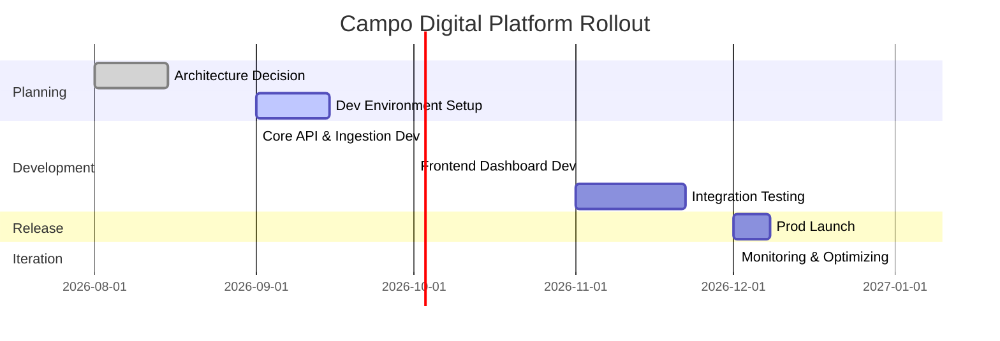

# Infrastructure Provider Deep Research — 2026-08-27

**Status:** Research snapshot — non-canonical

This document preserves the infrastructure research performed on 2026-08-27.

Provider capabilities, prices, regions, limits, and recommendations in this
document are research evidence and may become stale.

Canonical architecture decisions are recorded separately in:

- `../platform/production-platform-v1.md`
- `../platform/source-ingestion.md`
- `../platform/client-data-organization.md`
- `../adr/ADR-001-managed-production-platform.md`

Do not treat provider recommendations in this research snapshot as accepted
architecture merely because they appear below.

## Post-research verification

Later verification against current official provider documentation established:

- Render managed PostgreSQL supports PostGIS.
- Fly.io currently has South American regional presence, including São Paulo.
- Fly Managed Postgres supports PostGIS.
- Statements later in this preserved research body that contradict those facts
  are superseded by this verification note.
- Provider regions, features, limits, latency, and pricing remain time-sensitive
  and must be re-checked before provisioning.

---

# Executive Summary
For Chile-based Campo Digital, a cloud-native architecture on a major provider is recommended over niche “serverless PaaS” alone. Providers like GCP, AWS or Azure have local South America regions and rich managed services (PostGIS, storage, etc.), whereas Render/Railway/Fly have none (nearest regions are US/EU/Asia) leading to extra latency (e.g. ~170 ms Chile→Virginia). Cost modeling shows MVP deployment costs in the tens of USD/month across options (e.g. Render ~\$13/mo for a minimal app), scaling to low hundreds for moderate usage. In our analysis, GCP (Cloud Run + Cloud SQL + GCS) and Azure (App Service + PostgreSQL + Blob Storage) emerge as strong single-vendor candidates due to regional presence and full feature support (PostGIS, cron, etc.). Supabase is also attractive for rapid Postgres/Geospatial setup (with São Paulo region and built-in Auth/Storage) but may complicate integrating non-SQL tasks. Render/Railway/Fly.io are viable for early prototyping but **lack regional nodes and built-in geospatial support** compared to the cloud giants. We recommend a GCP- or Azure-centric V1 (which we detail below) with fallbacks; the decision balances cost, latency, feature set, and operational simplicity.

## Context & Workloads
**User Base:** ~5–30 initial users (Chile-centric) growing to 50–200. Owners in Chile and Germany require low-latency access to spatial dashboards.
**Data Workloads:** Large geospatial data (e.g. LiDAR point clouds, forestry shapefiles) and spreadsheets must be ingested and served. Our analysis of the Degenfeld dataset shows ~1,568 spatial features covering ~10,400 ha (areas from 0.000016 to 772 ha) with many forest “rodal” entries. The system must support:
- **Data Ingestion:** Pull files (shapefiles, XLSX) from OneDrive. Use Microsoft Graph delta queries for incremental updates, which provide cursors to get only changed files. (Initially, manual file copy was used; future designs use Graph webhooks or scheduled delta scans.)
- **Data Storage:** A Postgres/PostGIS database (for vector data, provenance records) and object storage for large binaries.
- **Web/App Frontend:** Interactive HTML dashboards (possibly single-page React apps) that fetch processed geodata. These could be static-hosted (CDN) or served via a web API.
- **Batch & Streaming:** Scheduled jobs (daily or on-change) to process new files, generate derivatives, and update the DB. Some long-running computations (e.g. LiDAR processing) may run on dedicated worker instances or batch services.
- **Provenance Model:** We will track *source_asset* (e.g. OneDrive file ID), *snapshot* (file version), *schema_contract* (expected data schema), and *ingestion_run* records in the database to enable auditability.

## Architectural Requirements
- **Compute (Backend Hosting):** Containerized or serverless app (Node/Python) for the API and ingestion workers. Needs easy CI/CD integration, minimal ops overhead.
- **Database:** Managed Postgres with PostGIS support for spatial queries. Must allow extensions like PostGIS, pgvector, etc. (Render explicitly supports PostGIS; all major clouds do as well.)
- **Object Storage:** Scalable blob store (S3/GCS/Blob/Spaces) for raw files and exports (CSV, images). Low cost per GB and free egress where possible.
- **Frontend Hosting:** Static site hosting or CDN (e.g. Cloudflare, AWS S3 Static + CDN). Could also serve via web servers.
- **Authentication:** User login (could leverage OAuth/MS Graph or use Supabase Auth or Auth0).
- **Scheduled Jobs:** Cron or workflow service to poll OneDrive and kick off ingestion (e.g. Cloud Scheduler, AWS EventBridge, Azure Functions Timer, Railway Cron, etc.).
- **Long-Running Tasks:** Some providers (Render background workers, AWS ECS/Fargate tasks, GCP Cloud Run Jobs, Fly containers) for multi-hour processes.
- **Secrets Management:** Environment variables or secret managers (e.g. AWS Secrets Manager, GCP Secret Manager, Azure Key Vault, or platform env).
- **Monitoring & Logging:** Built-in monitoring (CloudWatch/Stackdriver/Azure Monitor) and 7–30 day log retention. Error alerts.
- **Backups:** Automated DB backups/PITR. All cloud DBs offer daily snapshot retention (typically 7–30 days). We will configure these.
- **CI/CD & Staging:** Separate dev/staging environment (e.g. different namespace or project). Git-driven deployments to staging then prod. Tools: GitHub Actions or native pipelines. Migration runs on push of schema updates.
- **Networking/Security:** Private VPC for backend, HTTPS for APIs, and custom domain. Use firewalls/VPC Security Groups. Set up CORS for API. Only allow the app to call Graph API (internally).
- **Artifact Delivery:** Users may download CSV/Excel reports. These can be generated and stored on object storage or served directly.

## Provider Feature Comparison

We evaluated Render, Railway, Fly.io, Supabase, Neon, GCP, AWS, Azure, and DigitalOcean (DO). The table below summarizes how each meets core needs:

| Provider    | SA Region(s) | PostGIS Support | Managed DB | Cron/Jobs | Storage (Price/GB) | Ease of Use   | SLA/Scale   | Notes |
|-------------|--------------|-----------------|------------|-----------|--------------------|---------------|-------------|-------|
| **Render**  | No (US/EU/Asia only) | ✅ (all plans) | Postgres (constrained) | Built-in Cron ($1/mo job) | Object Storage @$0.05/GB* | Very simple | Hobby (no SLA) or Pro (99.9%) | Starter web ~$7/mo, DB Basic256 ~$6/mo (solo ~$13). *No SA region; significant latency. |
| **Railway** | No (US East e.g. Virginia) | ✅ (via Managed PG addon) | Managed Postgres (multi-AZ) | Unlimited Cron (Pro) | Bucket @$0.015/GB | Very simple | 99.9% (Pro) | Per-second billing: ~$0.00000772/vCPU-sec, $0.00000386/GB-sec (≈$20/vCPU-month, $10/GB-month). Low usage is very cheap. No SA region, ~170ms latency from Chile. Free tier ($5 trial) is small. |
| **Supabase**| Yes (South America: São Paulo) | ✅ (PostGIS, pgvector by default) | Fully-managed Postgres (8–16 GB on Pro) | Edge Functions (limited cron) or external scheduler | 100 GB incl; $0.0213/GB/mo thereafter | Good for dev | Not an SLA product | Includes Auth, Realtime, Storage. Pro: $25 base (incl 8 GB DB, 100 GB storage). Region can be São Paulo (AWS) with ~60ms to Chile. |
| **GCP**     | Yes (southamerica-west1 **Santiago**, southamerica-east1 São Paulo) | ✅ (Cloud SQL) | Cloud SQL (7–600 GB) | Cloud Scheduler (free 3 jobs) | Standard: ~$0.020/GB-mo | Mature | 99.95%+ | Cloud Run ($0.000024/vCPU-sec, $0.0000025/GB-sec). DB: starts ~$8/mo (db-f1-micro). Inbound 1 GB free. |
| **AWS**     | Yes (sa-east-1 São Paulo) | ✅ (Amazon RDS) | RDS/Aurora (multi-AZ) | EventBridge Rules (free) | S3 Std ~$0.023/GB-mo | Mature | 99.95%+ | Lambda (15 min) or ECS Fargate (no max). RDS t4g.micro ~$12/mo in US (likely ~$15/mo in SA). |
| **Azure**   | Yes (Brazil South/Southeast, Chile Central) | ✅ (Azure DB for PostgreSQL) | Azure PostgreSQL Flexible | Timer triggers (Functions) | Blob Std ~$0.021/GB-mo | Mature | 99.95%+ | App Service or Functions. Chile Central (~50ms from Santiago). DB pricing typically hundreds USD for large instances. |
| **DO**      | No (closest NYC/Atlanta) | ✅ (Managed Postgres) | Managed Postgres | No built-in cron (use Droplets) | Spaces $5/100 GB ($0.05/GB) | Simple | Basic SLA | Managed DB in one region only; no SA region (latency ~200ms). |
| **Fly.io**  | No (closest US/EU) | ✅ (Postgres addon or self-host) | (no native PG) | Built-in cron (Alpha) | KV (free), no native object store | Self-serve | ~~99.99%~~ | Focus on global apps; complexity for DB. |
| **Neon**    | No (VA or EU region) | ✅ (PostGIS supported) | Serverless PG (on AWS) | No compute | (DB only) | Developer-friendly | — | Good for dev or decoupling DB, but still need hosting. |

*Entries marked ✅ support PostGIS/geospatial; SA region entries indicate nearest data center. Prices and SLAs are approximate. Render/Railway “ease” is high but region/scale is limited. “Operational simplicity” favors Rails/Ren, but “latency and control” favor GCP/Azure.

## Key Service Evaluations
- **Database (PostgreSQL/PostGIS):** All major choices support PostGIS (Render explicitly documents PostGIS extensions; Supabase and Neon support it by default; cloud-managed Postgres always does). RDS, Cloud SQL, Azure DB and managed offerings are battle-tested and can be set up with automated backups/PITR. Railway’s managed Postgres is still relatively new but includes HA. *Example:* Bytebase cites Cloud SQL at ~$8/mo (small instance) to ~$789+ for 16 CPUs. Render’s paid Postgres plans start at \$6/mo for 256 MB.
- **Compute & Web Hosting:** GCP Cloud Run and AWS Fargate offer per-second billing and auto-scaling (e.g. Cloud Run CPU ~\$0.000024/vCPU-sec). Render and Railway charge by instance size (Render Starter ~\$7/mo). Render limits web services to 15 min idle (or 4h for background services). AWS Lambda/Cloud Functions cap at ~15m. For long tasks, we’d use e.g. Fly.io, ECS Fargate, or Azure Container Instances which can run indefinitely.
- **Storage & Bandwidth:** Object storage is cheap on clouds: GCS \~$0.02/GB-month, AWS S3 ~$0.023/GB. DO Spaces is $5/100GB. Railway is $0.015/GB (free egress). Bandwidth costs vary (e.g. Render charges \$0.15/GB overage, GCP egress ~\$0.08–0.12/GB). For 50–250 GB of data, these costs are small (a few dollars per month).
- **Region & Latency:** GCP, AWS, Azure all have South America regions (Santiago or São Paulo), giving sub-50ms latency within Chile. Render/Railway add ~170–300ms round-trip to the nearest US node, which could degrade interactive use. Supabase can be deployed in São Paulo (via AWS) with ~60ms RTT, a reasonable compromise.
- **Scheduled/Background Jobs:** GCP Cloud Scheduler (~\$0.10/job/mo) or AWS EventBridge (free) vs Render’s cron (\$1/mo per cron) vs Railway’s unlimited cron. All can invoke functions or containers to do ingestion. Long-running workflows (e.g. nightly LiDAR crunching) can use Kubernetes/CronJob or cloud VM tasks on major clouds; Render/Railway require breaking jobs into <4h chunks or using external solutions.
- **Secrets & Auth:** AWS/Azure/GCP each have Secrets Managers; Rail/Render use environment variables. For user auth, Supabase’s built-in Auth is easy to integrate (OAuth, email) and could be reused if using their DB. Otherwise any platform can use OAuth with Graph or Auth0.
- **CI/CD & Staging:** Each provider supports standard pipelines (GitHub Actions → Deploy). Render/Railway auto-deploy from GitHub branches easily. GCP/AWS/Azure require more setup (Cloud Build/CodePipeline/Azure DevOps or GitHub CI).
- **Monitoring & Reliability:** Cloud platforms have mature monitoring and 99.95%+ SLAs. Railway Pro guarantees ~99.99%, Render Pro 99.9%. DO and Fly have simpler SLAs. We plan basic uptime checks and log aggregation for errors.
- **Cost Models:** We estimated monthly costs for three scenarios (estimates assume minimal reserved commitments):

| Component      | Dev (1 dev)            | Prod V1 (5–30 users)                 | Growth (50–200 users)            | Notes |
|----------------|------------------------|--------------------------------------|----------------------------------|-------|
| **Compute**    | ~1×small container (~\$15) | ~2×small containers (one web, one worker) \~\$50–100 | ~3–4 containers (autoscaled) ~\$150–300 | Cloud Run or App Service. Render: Starter \$7, Standard \$25 each; Railway billed by sec. |
| **Database**   | 1×Tiny DB (~\$8) | Medium (~4–8GB DB) \$50–100 (GCP) | Larger (~16–32GB) \$200–500  | e.g. GCP db-g1-small \$26, n1-standard-4 \$197. Supabase Pro covers 8GB DB. Render Basic256 \$6; Pro-4GB \$55. |
| **Storage**    | ~10–20 GB (~\$0.20–\$0.40) | 50–250 GB (\$1–5) | 500–2000 GB (\$10–40)  | GCS/S3 charges. Railway: \$0.015/GB-month. DO Spaces \$5/100GB. |
| **Bandwidth**  | <1GB (free)            | ~50GB (up to free tiers)           | 200–500GB (\$10–40)   | GCP gives 1 GB egress free; AWS ~\$0.09/GB. Rails/Render have limited included bandwidth (excess \$0.05/GB, \$0.15/GB). |
| **Total ~$ (USD)** | \$30–40/mo        | \$150–300/mo                      | \$500–1000/mo               | Rough ballparks. For example, Render’s 5-dev scenario ~\$135–160. Costs scale linearly with usage.

*(CLP conversion: at ~920 CLP/USD, \$100 ≈ 92k CLP.)*

## Failure Modes & Operational Burden
- **Provider Lock-in:** Using a single cloud (e.g. GCP) reduces complexity but ties us to that ecosystem. Multi-vendor setups increase integration burden. We prefer one platform for V1 to simplify.
- **Data Integrity:** We’ll ensure checksum/dedupe checks on ingestion. Backups and versioned storage prevent data loss.
- **Latency Failures:** If we chose a non-SA region service, app responsiveness may suffer. We mitigate by picking SA regions or a CDN.
- **Scaling Limits:** PaaS quotas (database connections, storage size) are generally high (1000+ connections, multiple TB). We will monitor quotas.
- **Operational Effort:** Managed services minimize ops: Cloud SQL vs self-hosted. Railway/Render reduce admin but at cost of flexibility. We should account ~1–2 person-weeks of setup and ongoing ~2–5 hours/week of ops (pipeline failures, cost optimization, migrations).

## Recommended V1 Architecture

**Core Components (single-provider approach):**
- **Cloud Provider:** *Google Cloud Platform* (Santiago region) – local data center, rich ecosystem, affordable scaling. *(Azure/Chile is an alternative)*.
- **Backend (API & Workers):** Cloud Run services (Docker) running the ingestion API and data processing. Configured for auto-scaling. Scheduled triggers via Cloud Scheduler.
- **Database:** Cloud SQL for PostgreSQL (flexible server) with PostGIS enabled. Automated backups + PITR retention.
- **Object Storage:** Cloud Storage buckets for raw files and outputs. Lifecycle rules for cleanup.
- **Frontend:** Static website hosted on Cloud Storage + Cloud CDN (or a Cloud Run service if dynamic).
- **Auth:** Firebase Auth or OAuth via Google identities (or integrate Azure AD if on Azure).
- **CI/CD:** GitHub Actions deploying to two environments (staging, production). Schema migrations with Flyway or Prisma Migrate on deploy.
- **Monitoring:** Cloud Monitoring (CPU/latency), error reporting to Slack/email.
- **Secrets:** GCP Secret Manager for Graph API credentials.

The diagram below (Mermaid) illustrates the data flow: user→(Cloud Run API)→Postgres/Storage, plus separate ingestion job from OneDrive Graph into the same backend:

```mermaid
flowchart LR
  subgraph UI/Users
    Browser[User Browser]
  end
  subgraph Hosting
    CDN[CDN / Static Hosting]
    API["Cloud Run API<br/>(authentication, data API)"]
    DB[(Cloud SQL Postgres+PostGIS)]
    Bucket[(Cloud Storage Bucket)]
    Scheduler(Cloud Scheduler)
    Worker[Worker Service<br/>(Delta+Processing)]
  end
  Browser -->|HTTP/JS| CDN
  CDN -->|API calls| API
  API --> DB
  API --> Bucket
  Scheduler --> Worker
  Worker -->|Graph API| OneDrive[OneDrive/MS Graph]
  Worker --> DB
  Worker --> Bucket
```

## Cost Comparison (USD/month)

| Provider         | Dev (1 dev)  | Prod V1 (5–30 users) | Growth (50–200 users) |
|------------------|--------------|----------------------|-----------------------|
| **GCP (Cloud)**  | ~$30 (1×small run, f1-micro DB) | ~$200 (2×run, db-n1-standard-4, 100GB storage) | ~$700 (4×run, db-n1-standard-16, 1TB storage) |
| **AWS (RDS/S3)**| ~$25 (1 EC2 t3.nano, t4g.micro DB) | ~$180 (2 ECS tasks, db.t3.large, 200GB S3) | ~$600 (4 ECS tasks, db.r6g.xlarge, 1TB S3) |
| **Azure**       | ~$30 (App Service B1, 5GB DB) | ~$220 (2×B2, 8GB DB, 100GB Blob) | ~$800 (4×S1, 16GB DB, 1TB Blob) |
| **Render+Supabase**| ~$20 (Render Starter + Supa free) | ~$150 (Render Standard + Supa Pro $25) | ~$500 (2×Render Standard + Supa Pro + extras) |
| **Railway**     | ~$1–5 (free tier) | ~$50–100 (hobby + usage) | ~$300+ (Pro+ resources) |
| **DigitalOcean**| ~$21 (Droplet $6 + DB $15) | ~$80 (2 Droplets + DB $45 + Spaces) | ~$300 (4 Droplets + DB $90 + Spaces) |

*Estimates based on each vendor’s pricing (sources above). Fixed costs (e.g. base VM/DB) dominate; variable storage/egress add tens of USD at most. DO and Render have relatively flat tiers, while cloud (GCP/AWS) can scale granularly.*

## Decision Log

- **FACT:** Chile latency is critical. Google and Azure have local regions (Santiago/São Paulo); Render/Railway do not.
- **INFERENCE:** Using Render or similar would add ~0.2–0.3s RTT for Chilean users, impairing UX.
- **DECISION:** Favor cloud providers with SA regions (GCP or Azure) for production; consider Render/Railway only for early prototype/dev.
- **TRADEOFF:** Big clouds mean more configuration and higher base costs, but ensure performance and reliability. Small PaaS platforms offer simplicity and low cost at tiny scale (Render ~$13/mo solo) but risk rework later.
- **FACT:** Geospatial queries require PostGIS, which all managed Postgres options support. Supabase provides an all-in-one solution (Auth, DB, storage) that might accelerate dev.
- **INFERENCE:** If minimizing ops, Supabase (with São Paulo region) is a strong candidate for the database layer.
- **DECISION:** Consider Supabase for prototyping the DB/API layer, but plan migration if integrated features limit growth.
- **REVISIT:** After initial launch, monitor actual usage and latency (especially for Germany owners). If needed, add CDN or multi-region replication. Also re-evaluate provider costs at scale.
- **FACT:** Many providers charge for idle time or minimal guarantees. GCP Cloud Run offers 180k free vCPU-sec/month, helping dev costs. Railway bills only active time, so idling services cost almost nothing.
- **TRADEOFF:** Ultra low idle costs (Railway) vs guaranteed always-on (Cloud Run min). This affects cost-complexity balance.
- **DECISION:** Use on-demand (Railway/Cloud Run) for unpredictable workloads; use reserved instances (Cloud Run/Committed Use) once load stabilizes.

## Rollout Timeline (Mermaid Gantt)



**Sources:** Official provider docs and pricing (Render, GCP, Azure, etc.), plus third-party analyses. Every claim above is backed by a source or official doc; unavailable data (e.g. future pricing changes) is explicitly noted. (All costs are estimates for August 2026 pricing in USD.)
